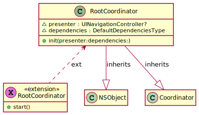
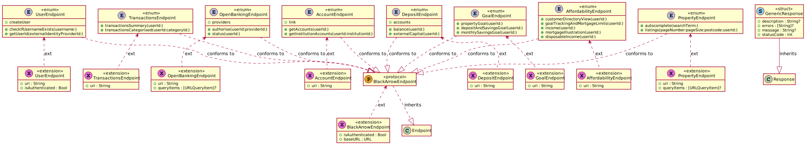

# app-affordiq-ios

[](https://sonarcloud.io/summary/new_code?id=BlackArrow-Group_app-affordiq-ios)

# Afford IQ iOS App

The Afford IQ iOS is compatible with iOS 13.0 or later, and iPhone 6S or later.

## Build Procedure

### Prerequisites

- MacOS Big Sur 
- bundler 2.1.4 or later
    - Note you may need to set a private GEM_HOME in your profile depending on how Ruby is set up e.g. export GEM_HOME="/Users/[your username]/.gem/ruby/"
- rbenv 1.1.2 or later
- Xcode 12.5

The Ruby version used is currently 2.6.5 for compatibility with Bitrise.

### Set Up Development Environment

- bundle install
- bundle exec pod install

### Configurations

- Debug
- Demo
- Release

See the corresponding xcconfig files in the project for settings for endpoints, authentication etc. e.g. for Release:

```BASE_URI = testapi.blackarrowgroup.io
BASE_PORT =
CLIENT_ID = jwxJz7xhpdpqNxbDuR7wjnbfK1pKZsgq
ISSUER_URI = blackarrow.eu.auth0.com
SCOPES = openid profile offline_access
REDIRECT_URI = $(PRODUCT_BUNDLE_IDENTIFIER):/$()/blackarrow.eu.auth0.com/ios/$(PRODUCT_BUNDLE_IDENTIFIER)/callback
LOGOUT_URI = $(PRODUCT_BUNDLE_IDENTIFIER):/$()/logout
OPEN_BANKING_URI = auth.truelayer.com
AUDIENCE_URI = http:/$()/testapi.blackarrowgroup.io/
APP_DISPLAY_NAME = AffordIQ
```

### Mocking

A mock server is included in the debug build of the applications. This is eliminated from all other configurations. Edit the Run action of the AffordIQ scheme to turn mocking on or off.

Mock data is provided by a stub implementation of the NetworkAgent protocol that loads and annotates JSON files from the [Responses](https://github.com/BlackArrow-Group/app-affordiq-ios/tree/main/AffordIQ/AffordIQMocks/Responses) folder.

### Local Service Debugging

A branch with configuration modifications to support debugging of local services is maintained at [localServiceDebug-auth0](https://github.com/BlackArrow-Group/app-affordiq-ios/tree/test/localServiceDebug-auth0). This should be regularly updated from main but never merged back.

### Build

- See the app-affordiq-ios project on [Bitrise](https://app.bitrise.io/app/826357a66a5cdfd4)  

    - Note the automated UI tests are currently hanging on Bitrise - run the tests locally to verify. Triggers are currently using the "quick-build-no-tests" workflow which is otherwise identical but skips the tests. 
    - A build is currently performed automatically when a push is made to the main branch.
    - Other builds may be initiated manually.
    
- A message will be sent to the Mobile App Builds group in Teams with a link to the installation page.

### Tests

The Test action in the AffordIQ scheme runs automated unit and UI tests. Coverage information is available from the Xcode report navigator or can be found under Apps & Artifacts (xcreport format) if the tests were excecuted using Bitrise.

# Components

## AffordIQ

_Note the host application currently does nothing except present the UI from the AffordIQUI framework by instantiating a RootCoordinator with its dependencies and starting it._



## AffordIQFoundation

- Application Styling


## AffordIQAPI

_Note: authentication is currently performed using Auth0, see AffordIQAuth0 library for implementation._
- Endpoints


- DTO
- Session and Networking


## AffordIQControls

- Custom controls used in the AffordIQAPI framework. These controls offer design time support.

## AffordIQUI

- Coordinators

- Forms

- Tables

- Data Publishers


